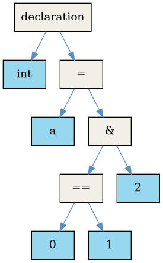

Though `Cold` derives most of its features from ANSI C, it being a new programming language gives us the liberty to reimagine some features.

Taking *https://craftinginterpreters.com/parsing-expressions.html#design-note* as inspiration, we decided to modify the operator precedence for our language.

Though we retain C syntax for the sake of ease of adoption, we feel this small modification makes our syntax more logical. This operator precedence is also similar to the one used by Python.

Comparison of relevant excerpts of operator precedence (highest to lowest):

| ANSI C       |     | Cold         |
| ------------ | --- | ------------ |
| +, -         |     | +, -         |
| <<, >>       |     | <<, >>       |
| <, >, <=, >= |     | Bitwise &    |
| ==, !=       |     | Bitwise ^    |
| Bitwise &    |     | Bitwise \|   |
| Bitwise ^    |     | <, >, <=, >= |
| Bitwise \|   |     | ==, !=       |
| Logical &&   |     | Logical &&   |
| Logical \|\| |     | Logical \|\| |

Due to this change, modifying a boolean flag and testing it won't need parentheses anymore. (That is, `if flag & MASK == other_flag` will perform desired operation of bitwise and before comparison).

For comparison here are ASTs for `int a = 0 == 1 & 2;` for ANSI C and Cold:

 | ANSI C              |     | Cold                |
 | ------------------- | --- | ------------------- |
 |  |     |  |
 